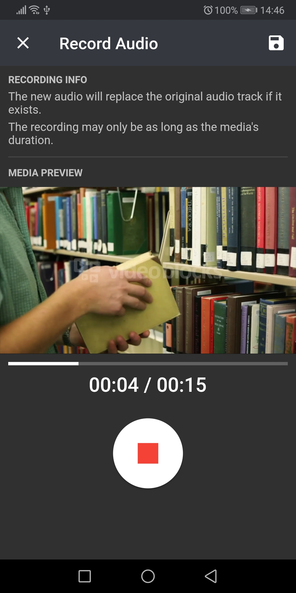

## Vision Director

The VisionDirector allows for collaborative Vision Video production with your Android device.

### About

Software development is an increasingly global process that involves different
teams and stakeholders. A common understanding of the planned system is
important for the success of the project. To ensure that everyone involved
has a shared understanding of the planned system, so called vision videos
can be used. These are better suited for unifying the vision than written
texts, since videos have a higher information content. The videos produced
can be used to elicit and secure requirements for the planned system.
However, videos are rarely used in practice because the effort to produce
them is assumed to be too high and users lack support. For spatially
or temporally distributed teams, the joint production of vision videos is
additionally hampered by missing or costly software.

### Vision Videos

A vision video is a video that represents a vision or parts of it for achieving shared understanding among all
parties involved by disclosing, discussing, and aligning their mental models of the future system.

### Stack

For more information about each component take a look at their respective READMEs.

- [App](/app/): The Flutter client.
- [Server](/server/): The server written using .NET.

### Images

<table><tr>
  <tr>
    <td></td>
    <td></td>
    <td></td>
    <td></td>
    </tr>
    <tr>
        <td style='text-align:center; vertical-align:middle'>
Timeline
</td>
        <td style='text-align:center; vertical-align:middle'>
Editor
</td>
        <td style='text-align:center; vertical-align:middle'>
Preview Scenario
</td>
        <td style='text-align:center; vertical-align:middle'>
Record Audio
</td>
    </tr>
    <tr>
    <td></td>
    <td></td>
    <td></td>
    <td></td>
  </tr>
      <tr>
        <td style='text-align:center; vertical-align:middle'>
Home
</td>
        <td style='text-align:center; vertical-align:middle'>
Tasks
</td>
        <td style='text-align:center; vertical-align:middle'>
Choose Template
</td>
        <td style='text-align:center; vertical-align:middle'>
Create Scenario
</td>
    </tr>
  </table>
