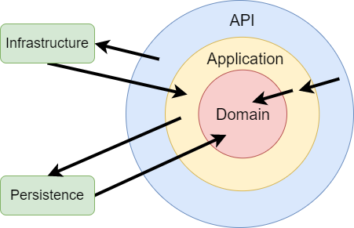

# Vision Director API

The server for the Vision Director using .NET 6. Includes an admin interface written in React.

## Architecture



The backend follows a Clean Architecture approach:

- `API`: Web API (HTTP, SignalR)
- `Application`: Business Logic
- `Domain`: Business / Database Entities
- `Infrastructure`: Implementations of `Application` interfaces. Classes for accessing external resources.
- `Persistence`: Database Layer

The arrows indicate dependencies (e.g. `API` depends on `Application`).

Additionally, each layer is then further divided into features (e.g. project related actions are in the `Projects`
directories)

## Stack

- CQRS and [MediatR](https://github.com/jbogard/MediatR)
- [AutoMapper](http://automapper.org)
- [Fluent Validation](https://github.com/JeremySkinner/FluentValidation)
- [SignalR](https://docs.microsoft.com/en-us/aspnet/core/signalr/introduction?view=aspnetcore-6.0) for Websocket Events
- [Entity Framework Core](https://docs.microsoft.com/en-us/ef/) on Postgresql
- Built-in Swagger via [Swashbuckle.AspNetCore](https://github.com/domaindrivendev/Swashbuckle.AspNetCore)
- JWT authentication
  using [ASP.NET Core JWT Bearer Authentication](https://github.com/aspnet/Security/tree/master/src/Microsoft.AspNetCore.Authentication.JwtBearer)
- Use [dotnet-format](https://github.com/dotnet/format) for style checking
- `.editorconfig` to enforce some usage patterns
- [XUnit](https://xunit.net/) and [Moq](https://github.com/moq) for testing

## Development

1. Install [.NET 6](https://dotnet.microsoft.com/en-us/download/dotnet/6.0)
2. Install [Docker](https://www.docker.com/) and get the Postgresql and Redis containers
   ```
   docker run --name postgres -p 5432:5432 -e POSTGRES_USER=root -e POSTGRES_PASSWORD=password -d postgres:alpine
   docker run --name redis -d -p 6379:6379 redis:alpine redis-server --save 60 1
   docker exec -it postgres createdb --username=root --owner=root vision_director
   ```
3. Execute `dotnet restore`
4. Execute `cd API && dotnet run`
5. Check `http://localhost:5000/docs` for the Swagger Docs and `http://localhost:5000` for the Admin Board

The admin's credentials are stored in the `appsettings.Development.json` file in the `API` directory.

After making changes to the `Domain` entities you might need to change `DataContext` as well. To create a new migration
run `dotnet ef migrations add <NAME> -p Persistence -s API` (You need to install [dotnet-ef](https://www.nuget.org/packages/dotnet-ef/) for that)

## Tests

This repository contains tests for the `Application` and `Infrastructure` layer. Check the respective projects in
the `tests` directory.

Run `dotnet test` to run them all.

## Admin Board

This repository contains a simple admin interface to view and manage the DB objects. It's written in React using
Typescript and Chakra UI for the styling. As it's not really part of the thesis and just made to easily view and edit
some data it's not particularly well made. Feel free to rewrite it.

1. Install Node 18
2. Run `yarn install` in the `admin-board` directory
3. Run `yarn start` and go to `localhost:3000`
4. Run `yarn build` to update the static files that get served by the backend (`wwwroot`)

## Credits

Based
on [this paid tutorial course](https://www.udemy.com/course/complete-guide-to-building-an-app-with-net-core-and-react/).
([Github Repository](https://github.com/TryCatchLearn/Reactivities))

(Just going through the commits might be enough to understand the backend structure)
